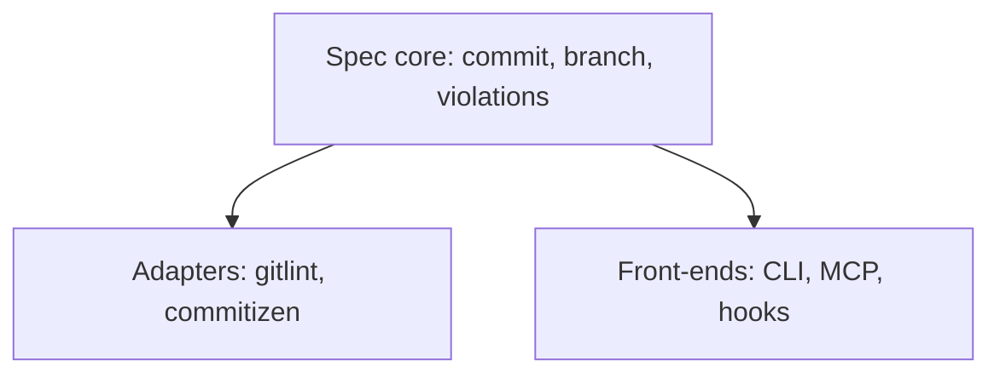

# conventional-git

[](https://github.com/gajaguar/conventional-git/actions/workflows/ci.yml)
[](https://github.com/gajaguar/conventional-git/actions/workflows/python.yml)
[](LICENSE)
[](pyproject.toml)
[](https://github.com/gajaguar/conventional-git)

Conventional Commits and Conventional Branch enforcement, validation, and
generation

## Contents

- [Why](#why)
- [Key features](#key-features)
- [Prerequisites](#prerequisites)
- [Installation](#installation)
- [Usage](#usage)
- [CLI reference](#cli-reference)
- [Configuration](#configuration)
- [Architecture](#architecture)
- [Open items](#open-items)
- [Contributing](#contributing)
- [License](#license)

## Why

One rule runs on three surfaces:

- A deterministic Git hook enforces it for human contributors.
- Structured violations over MCP let agents self-correct.
- A CLI lets you validate and generate names and messages directly.

## Key features

- Validate commits and branches with `code`, `field`, `message`, and
  `fix_hint` fields.
- Report `ERROR` and `WARNING` severity.
- Generate commit messages and branch names with `create`.
- Install Git hooks with `hook install`.
- Expose validation and convention details through MCP tools.
- Store the vocabulary as CSV data.
- Adapt the rules for gitlint and commitizen.

## Prerequisites

- Git
- Python >=3.14
- uv to use the tool
- mise to contribute to the project

## Installation

Clone the repository and install the local package:

```bash
git clone https://github.com/gajaguar/conventional-git
cd conventional-git
uv tool install .
conventional-git --help
```

Install with the `gitlint` extra (`uv tool install '.[gitlint]'`) to use
the gitlint adapter (`adapters/gitlint_rules.py`).

The package is not published on PyPI.

## Usage

### Validate

Validate a commit message with an option, a file, or standard input:

```bash
conventional-git check commit -m "feat: add login"
# commit: ok
conventional-git check commit -f .git/COMMIT_EDITMSG
printf 'feat: add login\n' | conventional-git check commit
```

The command exits with `0` for a valid message and `1` for a validation
failure. A warning is printed without changing the exit code when the report
remains valid.

Validate a branch by name or validate the current branch by default:

```bash
conventional-git check branch -n feat/add-login
# branch: ok
conventional-git check branch
```

The branch command uses the same exit codes: `0` for valid and `1` for an
invalid name. Trunk branches listed in `data/branch-trunks.csv` (`main`,
`master`, `develop`) are always valid and skip the `<type>/` requirement.

### Generate

Generate a commit message or branch name:

```bash
conventional-git create commit --type feat --description "add login"
# feat: add login
conventional-git create branch --type feature --description "add login"
# feature/add-login
```

Use `--dry-run` when you need the generated value without taking further
action. The current implementation prints the value in either mode.

### Enforce

Install `commit-msg`, `pre-commit`, and `pre-push` hooks in a repository:

```bash
conventional-git hook install --target ../my-repo
conventional-git hook install --target ../my-repo --force
conventional-git hook uninstall --target ../my-repo
```

Omit `--target` to use the current repository. `hook uninstall` removes the
three hooks created by the installer.

For the pre-commit framework, register the commit-message hook with
`language: system` so the CLI is available on `PATH`:

```yaml
- repo: https://github.com/gajaguar/conventional-git
  rev: v0.1.0
  hooks:
    - id: conventional-commit-msg
      language: system
```

The branch hook has an open issue because its pre-commit entry does not pass a
value to `--name`. See [Open items](#open-items).

### Python library

Import the rule modules and call their validators:

```python
from conventional_git.branch import rules as branch_rules
from conventional_git.commit import rules as commit_rules

commit_report = commit_rules.validate_message("Added stuff.")
branch_report = branch_rules.validate_name("feat/add-login")
```

Each call returns a `Report` containing `Violation` objects.

### MCP

Serve the Model Context Protocol over standard input and output:

```bash
conventional-git mcp serve
```

The server exposes `validate_commit_message`, `validate_branch_name`, and
`describe_convention`. See [MCP documentation](docs/mcp.md).

## CLI reference

All commands return `0` on success. Validation failures and invalid input
return `1`.

| Command        | Options                                                                                  | Exit          |
| :------------- | ---------------------------------------------------------------------------------------- | ------------: |
| check commit   | `-m, --message`; `-f, --file`; `--types-csv`                                             | 0 or 1        |
| check branch   | `-n, --name`; `--types-csv`                                                              | 0 or 1        |
| create commit  | `--type`; `--description`; `--scope`; `--body`; `--breaking`; `--types-csv`; `--dry-run` | 0 or 1        |
| create branch  | `--type`; `--description`; `--types-csv`; `--dry-run`                                    | 0 or 1        |
| hook install   | `--target`; `--force`                                                                    | 0 or 1        |
| hook uninstall | `--target`                                                                               | 0             |
| mcp serve      | No command-specific options                                                              | Server status |

Use `conventional-git <command> --help` for the full option descriptions.

## Configuration

Create `.conventional-git.toml` in the current repository:

| Key                             | Default | Purpose                                                   |
| :------------------------------ | ------- | --------------------------------------------------------- |
| `[commit] attribution_patterns` | `[]`    | Extra attribution patterns rejected by `check commit`     |
| `[commit] type_overrides`       | `[]`    | CSV files extending commit types                          |
| `[branch] type_overrides`       | `[]`    | CSV files intended to extend branch types                 |

The `--types-csv` option extends the default vocabulary; it does not replace
it. Vocabulary files live in `data/{commit,branch}-types.csv`.

## Architecture



The spec core contains the rules and returns `Report` objects. Adapters map
violations to consumer tools. Front-ends map user or agent input to the core
and render its output.

See [architecture](docs/architecture.md) and
[enforcement](docs/enforcement.md) for the detailed design.

```text
.
├── pyproject.toml
├── mk/python.mk
├── mk/conventional-git.mk     # conventional-git check and test targets
├── .pre-commit-hooks.yaml     # hooks for other repositories
├── src/conventional_git/
│   ├── violations.py          # Violation, Severity, Report
│   ├── commit/{grammar,rules,vocabulary}.py
│   ├── branch/{grammar,rules,vocabulary}.py
│   ├── config.py              # .conventional-git.toml loader
│   ├── helpers.py
│   ├── generation/{heuristic,protocol}.py
│   ├── data/{commit,branch}-types.csv
│   ├── adapters/{gitlint_rules,commitizen_config}.py
│   ├── cli/{app,check,create,hook,mcp}.py
│   └── mcp/server.py
├── skills/conventional-{commit,branch}/SKILL.md
└── tests/
```

## Open items

- The `conventional-branch-name` hook passes no value to `--name`.
- `[branch] type_overrides` is ignored.
- `--dry-run` has no effect beyond printing the generated value.
- The MCP tools ignore configuration.
- `generation/` is not wired to the CLI or MCP.
- The package is not published to PyPI.

## Contributing

Use mise to install the pinned toolchain, then install project dependencies:

```bash
make install
make check
make test
```

| Target               | Purpose                                |
| :------------------- | -------------------------------------- |
| `make install`       | Install tools, dependencies, and hooks |
| `make check`         | Run the read-only quality gate         |
| `make fix`           | Apply safe formatting and lint fixes   |
| `make test`          | Run the test suite                     |
| `make makefile-lint` | Check the Makefile                     |
| `make md-lint`       | Check Markdown                         |
| `make spell`         | Check spelling                         |

Use Conventional Commits for commit messages and Conventional Branch for
branch names. See [AGENTS.md](AGENTS.md) for the required workflow and coding
rules. See [toolchain.md](docs/toolchain.md) for tool placement decisions.

## License

Distributed under the MIT License. See [LICENSE](LICENSE).
