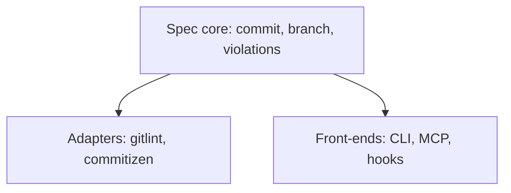

# conventional-git

[](https://github.com/gajaguar/conventional-git/actions/workflows/ci.yml)
[](https://github.com/gajaguar/conventional-git/actions/workflows/python.yml)
[](LICENSE)
[](pyproject.toml)
[](https://github.com/gajaguar/conventional-git)

Conventional Commits and Conventional Branch enforcement, validation, and
generation

## Contents

- [About](#about)
- [Key features](#key-features)
- [Requirements](#requirements)
- [Installation](#installation)
- [Usage](#usage)
- [Agents](#agents)
- [CLI reference](#cli-reference)
- [Configuration](#configuration)
- [Architecture](#architecture)
- [Platform notes](#platform-notes)
- [Documentation](#documentation)
- [Contributing](#contributing)
- [License](#license)

## About

One rule runs on three surfaces:

- A deterministic Git hook enforces it for human contributors.
- Structured violations over MCP let agents self-correct.
- A CLI lets you validate and generate names and messages directly.

## Key features

- Validate commits and branches with `code`, `field`, `message`, and
  `fix_hint` fields.
- Report `ERROR` and `WARNING` severity.
- Generate commit messages and branch names with `create`.
- Install Git hooks with `hook install`.
- Expose validation and convention details through MCP tools.
- Report installed extras, providers, and credential sources with
  `capabilities --json`.
- Store the vocabulary as CSV data.
- Adapt the rules for gitlint and commitizen.
- Distribute as a Claude Code plugin and an Agent Skills-compliant
  `skills/` directory.

## Requirements

- Git
- Python >=3.14
- uv to use the tool
- mise to contribute to the project

## Installation

Install the tool from PyPI:

```bash
uv tool install conventional-git
conventional-git --help
```

Install optional features with extras:

```bash
uv tool install 'conventional-git[mcp,llm]'
```

Contributors can clone the repository and install the local package instead:

```bash
git clone https://github.com/gajaguar/conventional-git
cd conventional-git
uv tool install .
```

Install the `gitlint` extra to use the gitlint adapter for a repository that
already runs gitlint, or to check a whole commit range in CI — see
[`docs/gitlint/index.md`](docs/gitlint/index.md). Install the `llm` extra to
enable the `jev` suggestion provider (see [Suggest](#suggest)).

## Usage

### Validate

Validate a commit message with an option, a file, or standard input:

```bash
conventional-git check commit -m "feat: add login"
# commit: ok
conventional-git check commit -f .git/COMMIT_EDITMSG
printf 'feat: add login\n' | conventional-git check commit
```

The command exits with `0` for a valid message and `1` for a validation
failure. A warning is printed without changing the exit code when the report
remains valid.

Validate a branch by name or validate the current branch by default:

```bash
conventional-git check branch -n feat/add-login
# branch: ok
conventional-git check branch
```

The branch command uses the same exit codes. Trunk branches listed in
`data/branch-trunks.csv` (`main`, `master`, `develop`) are always valid and
skip the `<type>/` requirement. So are branches that start with a prefix in
`data/branch-exempt-prefixes.csv` (`dependabot/`, `renovate/`): a bot names
those branches, and GitHub does not let you rename them.

### Generate

Generate a commit message or branch name:

```bash
conventional-git create commit --type feat --description "add login"
# feat: add login
conventional-git create branch --type feature --description "add login"
# feature/add-login
```

Use `--dry-run` when you need the generated value without taking further
action. The current implementation prints the value in either mode.

### Enforce

Install `commit-msg`, `pre-commit`, and `pre-push` hooks in a repository:

```bash
conventional-git hook install --target ../my-repo
```

Omit `--target` to use the current repository. See
[`docs/enforcement/index.md`](docs/enforcement/index.md) for how the
installer handles worktrees and `core.hooksPath`, wiring the hooks through
the pre-commit framework instead, and the CI recipe for re-checking after
`--no-verify`.

### Suggest

Generate a commit suggestion from a diff. Without the `llm` extra or a
credential, `create suggest` always falls back to the built-in heuristic
provider and prints a notice; it never fails the command:

```bash
git diff --cached | conventional-git create suggest --diff-file -
conventional-git create suggest --diff-file changes.diff --apply
```

With the `llm` extra installed and a credential available, `create suggest`
prefers the `jev` provider (TypeSafe's Jev model, either called directly or
routed through OpenRouter):

```bash
conventional-git auth login --provider openrouter  # or --provider typesafe
conventional-git create suggest --provider jev
```

> **The staged diff is sent to TypeSafe or OpenRouter.** Enabling `jev`
> means the diff text (and any secret staged in it) leaves the machine. See
> [`docs/suggestions/index.md`](docs/suggestions/index.md) for exactly
> what's sent, credential scope, and failure behavior before you enable it.

### Python library

Import the rule modules and call their validators:

```python
from conventional_git.branch import rules as branch_rules
from conventional_git.commit import rules as commit_rules

commit_report = commit_rules.validate_message("Added stuff.")
branch_report = branch_rules.validate_name("feat/add-login")
```

Each call returns a `Report` containing `Violation` objects.

### MCP

Requires the `mcp` extra: `pip install 'conventional-git[mcp]'`. Serve the
Model Context Protocol over standard input and output:

```bash
conventional-git mcp serve
```

Without installing the extra, an editor or agent can still run it on demand:

```bash
uvx --from 'conventional-git[mcp]' conventional-git-mcp
```

The server exposes `validate_commit_message`, `validate_branch_name`,
`describe_convention`, and `suggest_commit_message`. See
[`docs/mcp/index.md`](docs/mcp/index.md).

## Agents

The repository is both a Claude Code plugin and an
[Agent Skills](https://agentskills.io/specification)-compliant `skills/`
directory.

**Claude Code** — add the marketplace, then install the plugin (it bundles
`conventional-commit`, `conventional-branch`, and the MCP server):

```text
/plugin marketplace add gajaguar/conventional-git
/plugin install conventional-git@conventional-git-skills
```

See [`docs/mcp/plugin-bundled-server.md`](docs/mcp/plugin-bundled-server.md)
for how the bundled `.mcp.json` launches the server.

**Any other agent that supports Agent Skills** (Codex, Cursor, Gemini CLI,
Copilot, ...):

```bash
npx skills add gajaguar/conventional-git
```

Skills call `conventional-git capabilities --json` before drafting, so they
only offer `create suggest` (see [Suggest](#suggest)) when the `llm` extra
and a credential are both present, and never send a diff to a third party
without the user opting in through `--suggest`.

## CLI reference

All commands return `0` on success. Validation failures and invalid input
return `1`.

| Command        | Options                                                                                  |          Exit |
| :------------- | ---------------------------------------------------------------------------------------- | ------------: |
| check commit   | `-m, --message`; `-f, --file`; `--types-csv`                                             |        0 or 1 |
| check branch   | `-n, --name`; `--types-csv`                                                              |        0 or 1 |
| create commit  | `--type`; `--description`; `--scope`; `--body`; `--breaking`; `--types-csv`; `--dry-run` |        0 or 1 |
| create branch  | `--type`; `--description`; `--types-csv`; `--dry-run`                                    |        0 or 1 |
| create suggest | `--diff-file`; `--provider`; `--apply`                                                   |        0 or 1 |
| hook install   | `--target`; `--force`                                                                    |        0 or 1 |
| hook uninstall | `--target`                                                                               |             0 |
| auth login     | No command-specific options (requires the `llm` extra)                                   |        0 or 1 |
| auth status    | No command-specific options (requires the `llm` extra)                                   |        0 or 1 |
| auth logout    | No command-specific options (requires the `llm` extra)                                   |        0 or 1 |
| capabilities   | `--json`                                                                                 |             0 |
| mcp serve      | No command-specific options (requires the `mcp` extra)                                   | Server status |

Use `conventional-git <command> --help` for the full option descriptions.

## Configuration

Create `.conventional-git.toml` in the current repository:

| Key                                | Default       | Purpose                    |
| :--------------------------------- | ------------- | -------------------------- |
| `[commit] attribution_patterns`    | built-in list | Extra attribution regexes  |
| `[commit] type_overrides`          | `[]`          | Extra commit types         |
| `[branch] type_overrides`          | `[]`          | Extra branch types         |
| `[branch] trunk_overrides`         | `[]`          | Extra trunk branch names   |
| `[branch] exempt_prefix_overrides` | `[]`          | Extra exempt name prefixes |

Relative CSV paths in `type_overrides` / `trunk_overrides` /
`exempt_prefix_overrides` are resolved
against the directory containing `.conventional-git.toml`, not the process's
current directory. Every consumer that loads the file — the CLI, the MCP
server, and the gitlint adapter — honors it. See
[`docs/enforcement/attribution-trailers.md`](docs/enforcement/attribution-trailers.md)
for what `attribution_patterns` extends.

The `--types-csv` option extends the default vocabulary; it does not replace
it. Vocabulary files live in `data/{commit,branch}-types.csv`.

## Architecture


```mermaid
flowchart TD
    Core["Spec core: commit, branch, violations"]
    Adapters["Adapters: gitlint, commitizen"]
    Frontends["Front-ends: CLI, MCP, hooks"]
    Core --> Adapters
    Core --> Frontends
```

The spec core contains the rules and returns `Report` objects. Adapters map
violations to consumer tools. Front-ends map user or agent input to the core
and render its output. See [`docs/architecture/index.md`](docs/architecture/index.md).

```text
.
├── pyproject.toml
├── mk/python.mk
├── mk/conventional-git.mk     # conventional-git check and test targets
├── .pre-commit-hooks.yaml     # hooks for other repositories
├── src/conventional_git/
│   ├── violations.py          # Violation, Severity, Report
│   ├── commit/{grammar,rules,vocabulary}.py
│   ├── branch/{grammar,rules,vocabulary}.py
│   ├── config.py              # .conventional-git.toml loader
│   ├── helpers.py
│   ├── generation/{heuristic,protocol,typesafe,credentials}.py
│   ├── data/{commit,branch}-types.csv
│   ├── adapters/{gitlint_rules,commitizen_config}.py
│   ├── cli/{app,auth,check,create,hook,mcp}.py
│   └── mcp/server.py
├── skills/conventional-{commit,branch}/SKILL.md
└── tests/
```

## Platform notes

Git does not version `.git/hooks`, so each contributor installs the CLI and
runs `hook install` themselves rather than relying on a committed hook
script. A repository with `core.hooksPath` pointing elsewhere (for example
`.husky/`, set by another tool) still gets the hooks installed there — see
[`docs/enforcement/hook-install-path.md`](docs/enforcement/hook-install-path.md).

## Documentation

`docs/` is an [OKF](https://github.com/GoogleCloudPlatform/knowledge-catalog/blob/main/okf/SPEC.md)
bundle: one Markdown note per concept, indexed by
[`docs/index.md`](docs/index.md).

## Contributing

```bash
mise install
make install
make check
make test
```

See [CONTRIBUTING.md](CONTRIBUTING.md) for the full workflow, and
[AGENTS.md](AGENTS.md) for the coding rules an agent MUST follow.

## License

Distributed under the MIT License. See [LICENSE](LICENSE).
