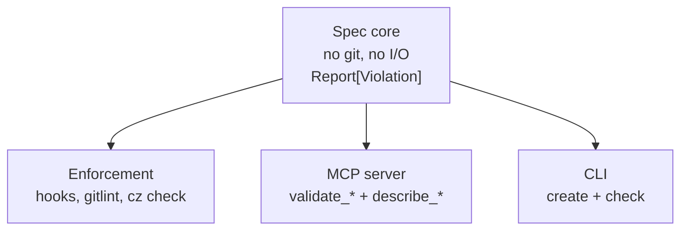

# Three layers, deliberately separated

A new rule MUST land in the core; an adapter that hardcodes the rule
duplicates it.

## Spec core

`commit/rules.py` and `branch/rules.py` are the only files that hold the
rule definitions. They take primitive input (a string, an optional
vocabulary set) and return a `Report` of `Violation`s. They MUST NOT import
anything that performs git operations or raises `SystemExit`. See
[the violation contract](violation-contract.md) for the shared data shape.

## Adapters

`adapters/gitlint_rules.py` translates between the core's `Violation` and
gitlint's error type; it is the only module that imports the gitlint SDK.
See [`gitlint/when-to-use.md`](../gitlint/when-to-use.md) for when and how to
use it. `adapters/commitizen_config.py` emits a commitizen
`pyproject.toml`/`.cz.toml` block as plain data (dict/JSON) — commitizen
itself reads that config, so the adapter has no SDK to import. See
[`enforcement/commitizen-adapter.md`](../enforcement/commitizen-adapter.md).

## Front-ends

- `cli/check.py` and `cli/create.py` — Typer commands. These are the only
  places that call `SystemExit`; their job is to map core output to exit
  codes and stderr text.
- `cli/hook.py` — installs and removes the Git hooks. See
  [`enforcement/hook-install-path.md`](../enforcement/hook-install-path.md).
- `cli/auth.py` — stores/reads the TypeSafe or OpenRouter credential used by
  the `jev` suggestion provider (requires the `llm` extra). See
  [`suggestions/keyring-scope.md`](../suggestions/keyring-scope.md).
- `mcp/server.py` — FastMCP server exposing `validate_commit_message`,
  `validate_branch_name`, `describe_convention`, and `suggest_commit_message`.
  See [`mcp/index.md`](../mcp/index.md). Requires the `mcp` extra; see
  [`optional-extras.md`](optional-extras.md) for how it stays lazy.

`helpers.py` contains shared transformations used by the front-ends.
